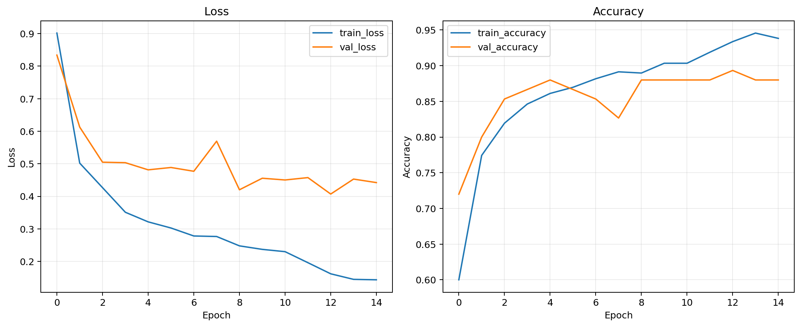
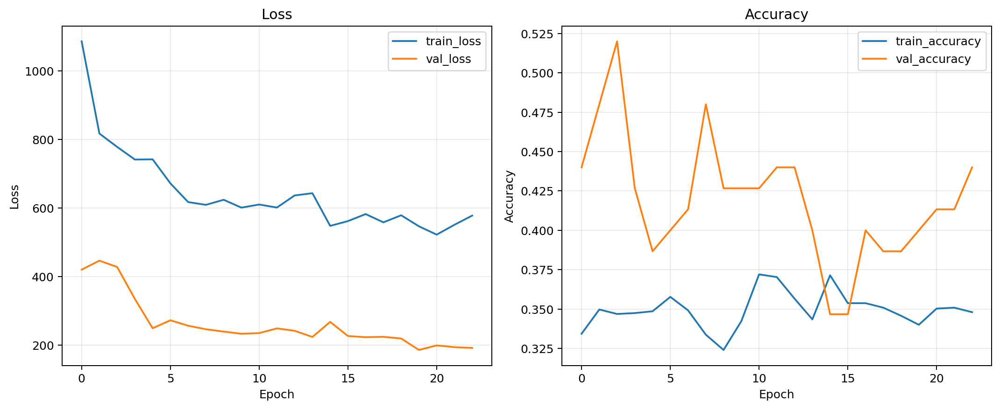
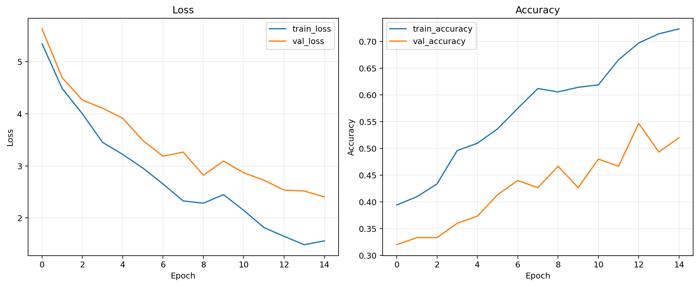
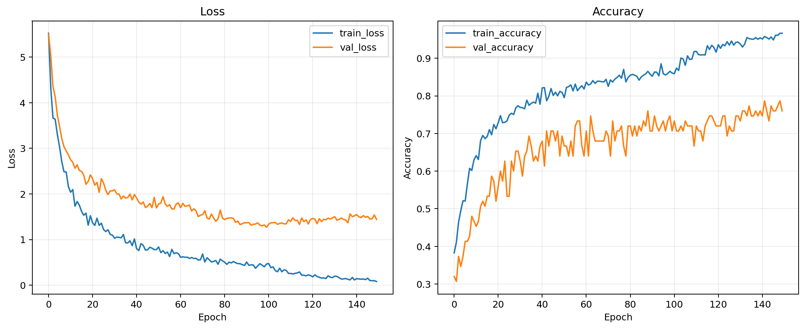
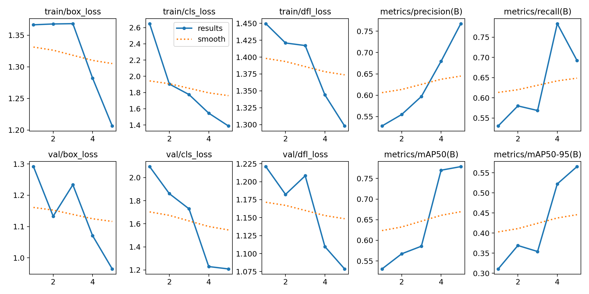
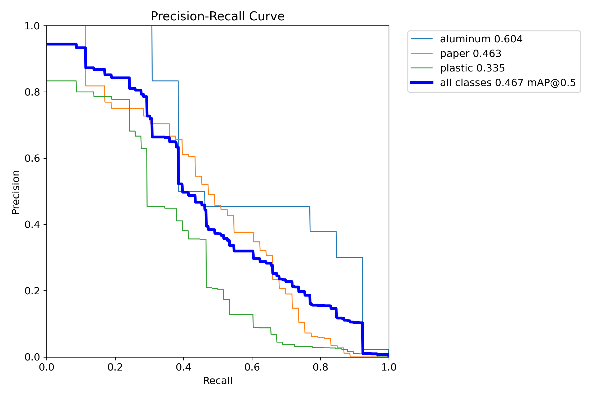

# Waste Classification

A MobileNetV2 image classifier for sorting waste into three categories:

- `E`: electronic waste
- `O`: organic waste
- `R`: recyclable waste

The model uses transfer learning with ImageNet weights and is trained on the
[Waste Classification Dataset](https://www.kaggle.com/datasets/shubhamdivakar/waste-classification-dataset).

## Test Results

The final model was evaluated on 2,539 test images.

| Class | Precision | Recall | F1-score | Support |
|---|---:|---:|---:|---:|
| Electronic (`E`) | 0.79 | 1.00 | 0.88 | 26 |
| Organic (`O`) | 0.93 | 0.97 | 0.95 | 1,401 |
| Recyclable (`R`) | 0.96 | 0.90 | 0.93 | 1,112 |
| **Accuracy** |  |  | **0.94** | **2,539** |
| **Macro average** | **0.89** | **0.96** | **0.92** | **2,539** |
| **Weighted average** | **0.94** | **0.94** | **0.94** | **2,539** |

The model correctly classified all 26 electronic-waste test images. However,
the electronic class has very limited support, so its metrics are less reliable
than those for the organic and recyclable classes. More electronic-waste data
is needed before relying on this model in production.

### Confusion Matrix

| Actual \ Predicted | E | O | R |
|---|---:|---:|---:|
| E | 26 | 0 | 0 |
| O | 0 | 1,361 | 40 |
| R | 7 | 106 | 999 |

### Misclassified Examples

The following gallery shows the 25 most confident incorrect predictions. Each
image includes its true class, predicted class, and the model's confidence in
the incorrect prediction.


## Setup

Create and activate a virtual environment, then install the dependencies:

```powershell
python -m venv .venv
.\.venv\Scripts\Activate.ps1
python -m pip install -r requirements.txt
```

Copy `.env.example` to `.env` and adjust the settings when needed. Leaving
`DATASET_DIR` empty lets `kagglehub` download or locate the dataset
automatically.

## Training

```powershell
.\.venv\Scripts\python.exe MobileNetV2\train_mobilenetv2.py
```

Training produces the following files under `artifacts/`:

- `waste_mobilenetv2.keras`: final Keras model
- `waste_mobilenetv2.tflite`: TensorFlow Lite export
- `best_head.keras`: best classifier-head checkpoint
- `best_fine_tuned.keras`: best fine-tuning checkpoint
- `labels.json`: model class order
- `history.json`: epoch-by-epoch training metrics
- `test_metrics.json`: final test loss and accuracy

## Evaluation

```powershell
.\.venv\Scripts\python.exe MobileNetV2\evaluate_mobilenetv2.py
```

Evaluation outputs are written to `artifacts/evaluation/`:

- Classification report in text and JSON formats
- Raw and normalized confusion-matrix images
- Predictions for every test image in CSV format
- A gallery of the most confident misclassifications

## EcoDetect MobileNetV2

The EcoDetect dataset is YOLO-formatted, so
`MobileNetV2/train_ecodetect_mobilenetv2.py` converts each image's bounding-box
annotations into one image-level class before training a MobileNetV2 classifier.
If an image has multiple object classes, the largest bounding box decides the
image label.

Run a smoke check:

```powershell
.\.venv\Scripts\python.exe MobileNetV2\train_ecodetect_mobilenetv2.py --check-only
```

Train the model:

```powershell
.\.venv\Scripts\python.exe MobileNetV2\train_ecodetect_mobilenetv2.py
```

The EcoDetect run saves the model, TensorFlow Lite export, training curves,
classification report, confusion matrices, predictions CSV, and misclassified
example gallery under `artifacts/ecodetect/mobilenetv2`.

The MobileNetV2 EcoDetect pipeline supports extra imbalance controls under
`training.class_weight_multipliers`. The current config applies an additional
`1.5x` multiplier to `aluminum` after inverse-frequency class weighting, raising
the training weight for aluminum from `1.9444` to `2.9167`. The script also
supports optional focal loss through `training.focal_loss_gamma`; it is disabled
by default because the saved focal-loss experiment reduced test performance.

## EcoDetect MobileNetV3

`MobileNetV3/train_ecodetect_mobilenetv3.py` uses the same EcoDetect
classification pipeline with a MobileNetV3Small backbone.

Run a smoke check:

```powershell
.\.venv\Scripts\python.exe MobileNetV3\train_ecodetect_mobilenetv3.py --check-only
```

Train and evaluate MobileNetV3:

```powershell
.\.venv\Scripts\python.exe MobileNetV3\train_ecodetect_mobilenetv3.py
```

Outputs are saved under `artifacts/ecodetect/mobilenetv3`.

## EcoDetect MobileNetV4

`MobileNetV4/train_ecodetect_mobilenetv4.py` trains a MobileNetV4 classifier
through PyTorch and `timm`, using the same largest-bounding-box image label
conversion as the MobileNetV2 and MobileNetV3 pipelines.

Run a smoke check:

```powershell
.\.venv\Scripts\python.exe MobileNetV4\train_ecodetect_mobilenetv4.py --check-only
```

Train and evaluate MobileNetV4:

```powershell
.\.venv\Scripts\python.exe MobileNetV4\train_ecodetect_mobilenetv4.py
```

Disable early stopping when you want every requested epoch to run:

```powershell
.\.venv\Scripts\python.exe MobileNetV4\train_ecodetect_mobilenetv4.py --no-early-stopping
```

Outputs are saved under `artifacts/ecodetect/mobilenetv4`.

## EcoDetect YOLOv11

`YOLOv11/train_ecodetect_yolov11.py` trains object detection directly on the
EcoDetect YOLO labels. It prepares a local `data.yaml` with correct paths, then
uses Ultralytics YOLOv11.

Run a smoke check:

```powershell
.\.venv\Scripts\python.exe YOLOv11\train_ecodetect_yolov11.py --check-only
```

Train and evaluate YOLOv11:

```powershell
.\.venv\Scripts\python.exe YOLOv11\train_ecodetect_yolov11.py
```

Outputs are saved under `artifacts/ecodetect/yolov11/train`, and test
evaluation outputs are saved under `artifacts/ecodetect/yolov11/train_test`.
Ultralytics writes plots such as `results.png`, `confusion_matrix.png`, and
`confusion_matrix_normalized.png` in those run folders.

## TACO Mask R-CNN

The [TACO dataset](https://github.com/pedropro/TACO) provides COCO-style
instance-segmentation annotations for litter images. `TACO/train_taco_maskrcnn.py`
trains a Torchvision Mask R-CNN model from those polygon masks.

First download TACO with the upstream repository instructions, then set
`dataset.dir` in `TACO/config.yaml` to the folder that contains
`annotations.json` and the `batch_*` image folders.

Run a smoke check:

```powershell
.\.venv\Scripts\python.exe TACO\train_taco_maskrcnn.py --check-only
```

Train Mask R-CNN:

```powershell
.\.venv\Scripts\python.exe TACO\train_taco_maskrcnn.py
```

By default the script merges TACO categories by `supercategory`, which gives
Mask R-CNN denser waste groups than the sparse raw category names. Change
`dataset.category_field` to `name` if you want every original TACO category as
its own class. Outputs are saved under `artifacts/taco/maskrcnn`.

## EcoDetect Model Comparison

The EcoDetect runs compare three image-level MobileNet classifiers with one
YOLOv11 object detector on the same 75-image test split. The MobileNet scripts
convert each YOLO image into one class label using the largest bounding box,
while YOLOv11 keeps the original bounding boxes and is evaluated with detection
metrics.

| Model | Task | Test images | Primary result | Weighted F1 / mAP50-95 | Notes |
|---|---|---:|---:|---:|---|
| MobileNetV2 | Image classification | 75 | 69.33% accuracy | 0.6913 weighted F1 | Best saved image classifier. |
| MobileNetV3Small | Image classification | 75 | 40.00% accuracy | 0.4203 weighted F1 | Weakest MobileNet run. |
| MobileNetV4 Conv Small | Image classification | 75 | 48.00% accuracy | 0.5023 weighted F1 | Baseline V4 run; better than V3 but behind V2. |
| MobileNetV4 Conv Small, Colab middle run | Image classification | 75 | 53.33% accuracy | 0.5234 weighted F1 | Best saved V4 accuracy, still below V2. |
| MobileNetV4 Conv Small, Colab more-epochs run | Image classification | 75 | 53.33% accuracy | 0.5179 weighted F1 | Similar accuracy to the middle run, lower weighted F1. |
| YOLOv11 | Object detection | 75 | 46.74% mAP50 | 33.47% mAP50-95 | Higher recall than precision; use when localization is required. |

YOLOv11 detection summary:

| Metric | Value |
|---|---:|
| mAP50 | 46.74% |
| mAP50-95 | 33.47% |
| mAP75 | 40.01% |
| Mean precision | 37.63% |
| Mean recall | 59.40% |

These YOLO metrics evaluate both the predicted class and the predicted bounding
box location. `mAP50` is the more forgiving score: a prediction counts as
correct if its box overlaps the ground-truth box by at least 50% IoU
(`intersection over union`). The saved YOLOv11 run reached 46.74% mAP50, so it
finds some useful detections at this looser overlap threshold.

`mAP50-95` is stricter because it averages mAP across IoU thresholds from 50%
to 95%. The saved score is 33.47%, which means performance drops when the boxes
need to be placed more precisely. `mAP75` is an intermediate check at 75% IoU;
the saved run reached 40.01%.

Mean precision answers: "When YOLO predicts an object, how often is it right?"
The saved precision is 37.63%, so the detector produces many false positives.
Mean recall answers: "Out of all real objects, how many did YOLO find?" The
saved recall is 59.40%, so it finds more than half of the objects but still
misses a substantial number. In short, this YOLOv11 run is better at noticing
possible objects than being selective and confident.

### Class-Level Results

| Model | Aluminum F1 | Paper F1 | Plastic F1 | Accuracy |
|---|---:|---:|---:|---:|
| MobileNetV2 | 0.471 | 0.702 | 0.737 | 69.33% |
| MobileNetV3Small | 0.278 | 0.415 | 0.459 | 40.00% |
| MobileNetV4 Conv Small | 0.294 | 0.489 | 0.563 | 48.00% |
| MobileNetV4 Colab middle | 0.296 | 0.390 | 0.683 | 53.33% |
| MobileNetV4 Colab more epochs | 0.250 | 0.381 | 0.690 | 53.33% |

MobileNetV2 is the best overall image classifier in the saved results. It has
the strongest balance across `paper` and `plastic`, but it still struggles with
`aluminum` because the test split has only 9 aluminum images. MobileNetV4's
newer Colab runs improve over the baseline V4 run, mostly by improving
`plastic`, but they still do not beat MobileNetV2. MobileNetV3Small is not
competitive on these artifacts.

YOLOv11 solves a harder task because it must find object locations as well as
classes. Its recall is higher than its precision, so it finds a reasonable
share of objects but produces more false positives. Use YOLOv11 when bounding
boxes are needed; use MobileNetV2 when the goal is one label per image.

### MobileNetV2 Aluminum Imbalance Check

MobileNetV2 was retrained with stronger aluminum weighting because it was the
strongest classifier overall. The safer class-weight multiplier run kept
overall accuracy and weighted F1 essentially unchanged, but did not improve
aluminum precision or recall. A focal-loss follow-up run hurt aluminum
precision and overall accuracy.

| Run | Aluminum handling | Aluminum precision | Aluminum recall | Accuracy | Weighted F1 |
|---|---|---:|---:|---:|---:|
| Baseline MobileNetV2 | inverse-frequency class weights | 0.50 | 0.44 | 0.6933 | 0.6913 |
| Aluminum multiplier | aluminum class weight `1.5x` after balancing | 0.50 | 0.44 | 0.6933 | 0.6915 |
| Aluminum multiplier + focal loss | aluminum class weight `1.5x`, focal gamma `1.5` | 0.33 | 0.44 | 0.6667 | 0.6732 |

Artifacts for the safer retrain are under
[`artifacts/ecodetect/mobilenetv2_aluminum_balanced`](artifacts/ecodetect/mobilenetv2_aluminum_balanced),
and the focal-loss experiment is under
[`artifacts/ecodetect/mobilenetv2_aluminum_focal`](artifacts/ecodetect/mobilenetv2_aluminum_focal).

### Training and Evaluation Artifacts

| Model | Training curves | Confusion matrix | Metrics and reports |
|---|---|---|---|
| MobileNetV2 | [`training_curves.png`](artifacts/ecodetect/mobilenetv2/training_curves.png) | [`confusion_matrix.png`](artifacts/ecodetect/mobilenetv2/confusion_matrix.png), [`confusion_matrix_normalized.png`](artifacts/ecodetect/mobilenetv2/confusion_matrix_normalized.png) | [`test_metrics.json`](artifacts/ecodetect/mobilenetv2/test_metrics.json), [`classification_report.txt`](artifacts/ecodetect/mobilenetv2/classification_report.txt), [`predictions.csv`](artifacts/ecodetect/mobilenetv2/predictions.csv) |
| MobileNetV3Small | [`training_curves.png`](artifacts/ecodetect/mobilenetv3/training_curves.png) | [`confusion_matrix.png`](artifacts/ecodetect/mobilenetv3/confusion_matrix.png), [`confusion_matrix_normalized.png`](artifacts/ecodetect/mobilenetv3/confusion_matrix_normalized.png) | [`test_metrics.json`](artifacts/ecodetect/mobilenetv3/test_metrics.json), [`classification_report.txt`](artifacts/ecodetect/mobilenetv3/classification_report.txt), [`predictions.csv`](artifacts/ecodetect/mobilenetv3/predictions.csv) |
| MobileNetV4 Conv Small | [`training_curves.png`](artifacts/ecodetect/mobilenetv4/training_curves.png) | [`confusion_matrix.png`](artifacts/ecodetect/mobilenetv4/confusion_matrix.png), [`confusion_matrix_normalized.png`](artifacts/ecodetect/mobilenetv4/confusion_matrix_normalized.png) | [`test_metrics.json`](artifacts/ecodetect/mobilenetv4/test_metrics.json), [`classification_report.txt`](artifacts/ecodetect/mobilenetv4/classification_report.txt), [`predictions.csv`](artifacts/ecodetect/mobilenetv4/predictions.csv) |
| MobileNetV4 Colab middle | [`training_curves.png`](artifacts/ecodetect/mobilenetv4_colab_middle/training_curves.png) | [`confusion_matrix.png`](artifacts/ecodetect/mobilenetv4_colab_middle/confusion_matrix.png), [`confusion_matrix_normalized.png`](artifacts/ecodetect/mobilenetv4_colab_middle/confusion_matrix_normalized.png) | [`test_metrics.json`](artifacts/ecodetect/mobilenetv4_colab_middle/test_metrics.json), [`classification_report.txt`](artifacts/ecodetect/mobilenetv4_colab_middle/classification_report.txt), [`predictions.csv`](artifacts/ecodetect/mobilenetv4_colab_middle/predictions.csv) |
| MobileNetV4 Colab more epochs | [`training_curves.png`](artifacts/ecodetect/mobilenetv4_colab_more_epochs/training_curves.png) | [`confusion_matrix.png`](artifacts/ecodetect/mobilenetv4_colab_more_epochs/confusion_matrix.png), [`confusion_matrix_normalized.png`](artifacts/ecodetect/mobilenetv4_colab_more_epochs/confusion_matrix_normalized.png) | [`test_metrics.json`](artifacts/ecodetect/mobilenetv4_colab_more_epochs/test_metrics.json), [`classification_report.txt`](artifacts/ecodetect/mobilenetv4_colab_more_epochs/classification_report.txt), [`predictions.csv`](artifacts/ecodetect/mobilenetv4_colab_more_epochs/predictions.csv) |
| YOLOv11 | [`results.png`](artifacts/ecodetect/yolov11/runs/detect/artifacts/ecodetect/yolov11/train/results.png), [`results.csv`](artifacts/ecodetect/yolov11/runs/detect/artifacts/ecodetect/yolov11/train/results.csv) | [`confusion_matrix.png`](artifacts/ecodetect/yolov11/runs/detect/artifacts/ecodetect/yolov11/train_test/confusion_matrix.png), [`confusion_matrix_normalized.png`](artifacts/ecodetect/yolov11/runs/detect/artifacts/ecodetect/yolov11/train_test/confusion_matrix_normalized.png) | [`evaluation_summary.json`](artifacts/ecodetect/yolov11/runs/detect/artifacts/ecodetect/yolov11/train/evaluation_summary.json), [`BoxPR_curve.png`](artifacts/ecodetect/yolov11/runs/detect/artifacts/ecodetect/yolov11/train_test/BoxPR_curve.png), [`BoxF1_curve.png`](artifacts/ecodetect/yolov11/runs/detect/artifacts/ecodetect/yolov11/train_test/BoxF1_curve.png) |

#### MobileNetV2 Training Curves



#### MobileNetV3Small Training Curves



#### MobileNetV4 Conv Small Training Curves



#### Best Saved MobileNetV4 Training Curves



#### YOLOv11 Training Curves



#### YOLOv11 Precision-Recall Curve


